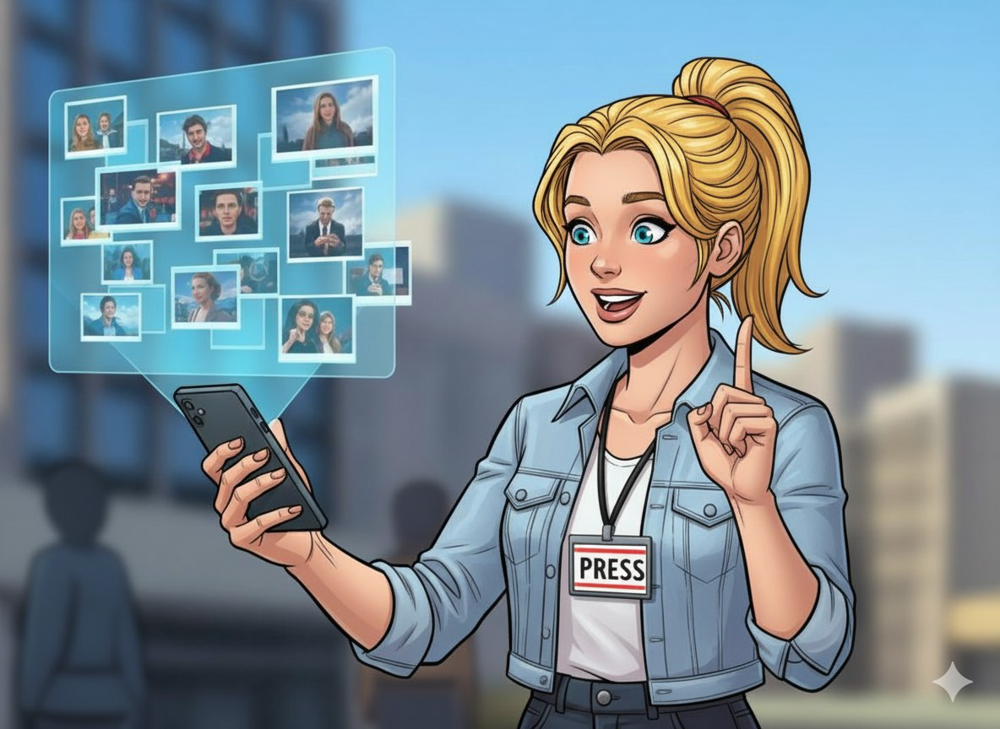
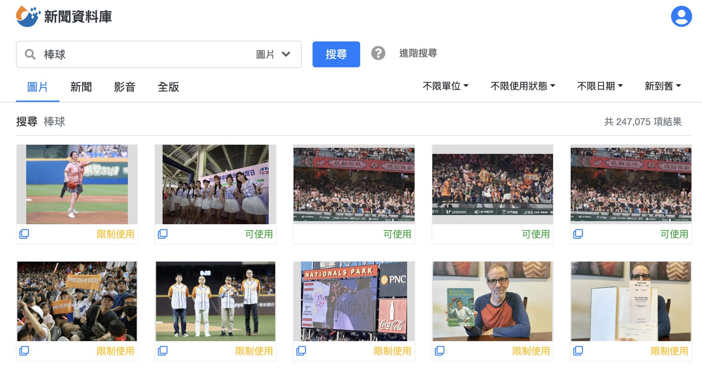

# 自動配圖升級！那些編輯說的話，變成了我們的最佳化

**專欄**　企業內部刊物　·　篇序 ①
**主題**　產品改版紀錄
**我的角色**　使用者訪談、優化項目排序、排序邏輯定義

> 功能上線後使用率不如預期，我去訪談了記者與編輯，再照他們說的重排優化順序。

---

在新聞製作的流程裡，「配圖」常是個令人頭痛的環節。尤其在時間壓力下，要額外到報系新聞資料庫系統翻、去自己的圖庫找，甚至在沒有合適的圖片時，要用示意圖硬塞，只為了讓新聞列表好看、要讓新聞點進來有圖片。

為了讓這件事變更簡單，2023 年 9 月在編務系統推出第一版「自動配圖」功能，今年一月把功能也整合到記者發稿 app，希望能幫大家省下一點時間。然而，自動配圖上線後，整體使用率不如預期。於是我們依照使用量，訪談記者和編輯，想看看到底發生什麼事？

## 我們收集到的困擾

幾場訪談下來，受訪同仁給我們實質的回饋：

**圖片不夠貼近新聞**
> 「搜金秀賢結果跑出陳其邁，跟金秀賢完全沒有關係。」

自動配圖有時無法抓到重點，搜出來的圖片和標籤重點對不上。

**數量太少、太單一**
> 「搜尋結果的圖片太少了，還有很多一樣的照片或限制使用的照片。」

需要多角度配圖時，明顯不夠用。

**標籤太亂、不好用**
> 「我只想搜健保，卻冒出一堆無關標籤，還要一個一個刪掉。」

標籤缺乏整理，反而造成負擔。

**使用習慣沒有養成**
> 「我其實不知道這功能入口在哪。」
> 「我點過一次，覺得速度不快，就回去用典藏了。」

有些同仁壓根不知道有這功能，有些同仁試過一次就放棄。

## 我們做了哪些調整？

蒐集分析回饋後，我們針對主要痛點做改善：

1. **圖象理解增強**
   加入視覺模型，透過 AI 對圖片的理解力，能更精確地判別圖片並分類。

2. **增加人臉辨識圖庫量**
   擴充人臉辨識圖庫，增加可識別名單，搜尋名人時更加精確。

3. **標籤更精準**
   重新設計 AI 標籤機制，過濾掉多餘的標籤，讓搜尋結果更貼近新聞主題。

4. **圖片更多元、排序更聰明**
   擴充圖片來源與數量，不再只有少少幾張；排序也調整成「新聞相關度＋時效性＋可用性」優先。

**調整前後對照**

*調整前：較容易出現與主題不相關的圖片*

*調整後：搜尋結果與主題的相關度明顯提升*

## 下階段展望

這次的最佳化解決了部分痛點，但我們知道使用者還有更多期待：

- 有人希望能看到更多「示意圖」而不僅限於新聞照片。
- 有人提到，如果能連自己拍的照片或攝影中心的素材都能整合，就更方便了。
- 也有人期待未來 AI 能直接生成新聞需要的示意圖。

這些建議我們都記下來了。未來，我們會持續觀察大家的使用情況，也會再收集回饋，讓「自動配圖」慢慢變成一個可靠、能減少作業時間的小幫手。

## 後記

現階段自動配圖的目標，不是要讓 AI 去決定該用哪張照片，而是希望在時間緊迫的新聞現場，幫忙更快找到可用的照片。尤其在即時新聞「分秒必爭」的發稿現場，讓自動配圖能成為一個加速器，讓記者和編輯把時間專注在稿件內容本身，不是卡在找圖這件事。

未來有個更長遠的夢想，當進稿的新聞沒有配圖時，依照新聞屬性、圖片使用權找一張「適法合規」的圖片直接配到新聞，成為名副其實的「真 · 自動配圖」。然而，夢想成真前，我們先務實地依照編輯們的回饋和使用體驗，持續改善、貼近需求，讓自動配圖能真的幫上忙，成為新聞產製流程中更有用的環節。
