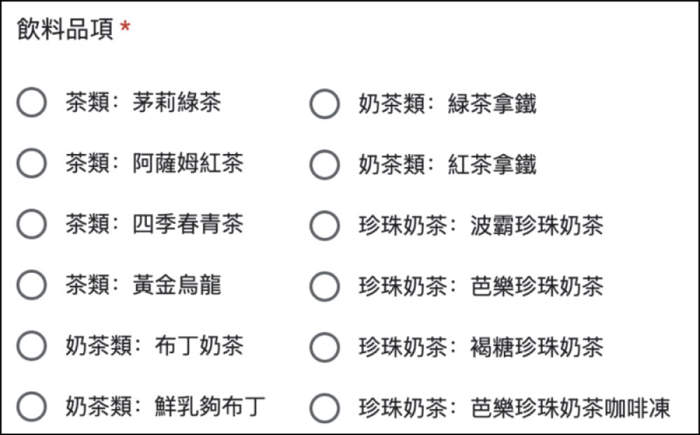
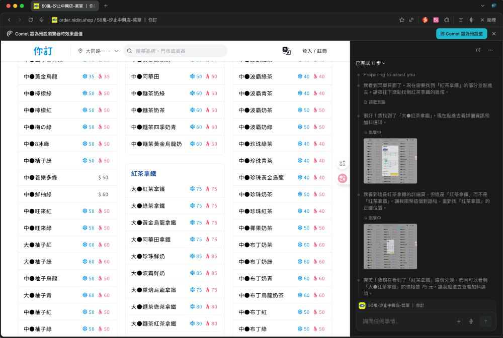
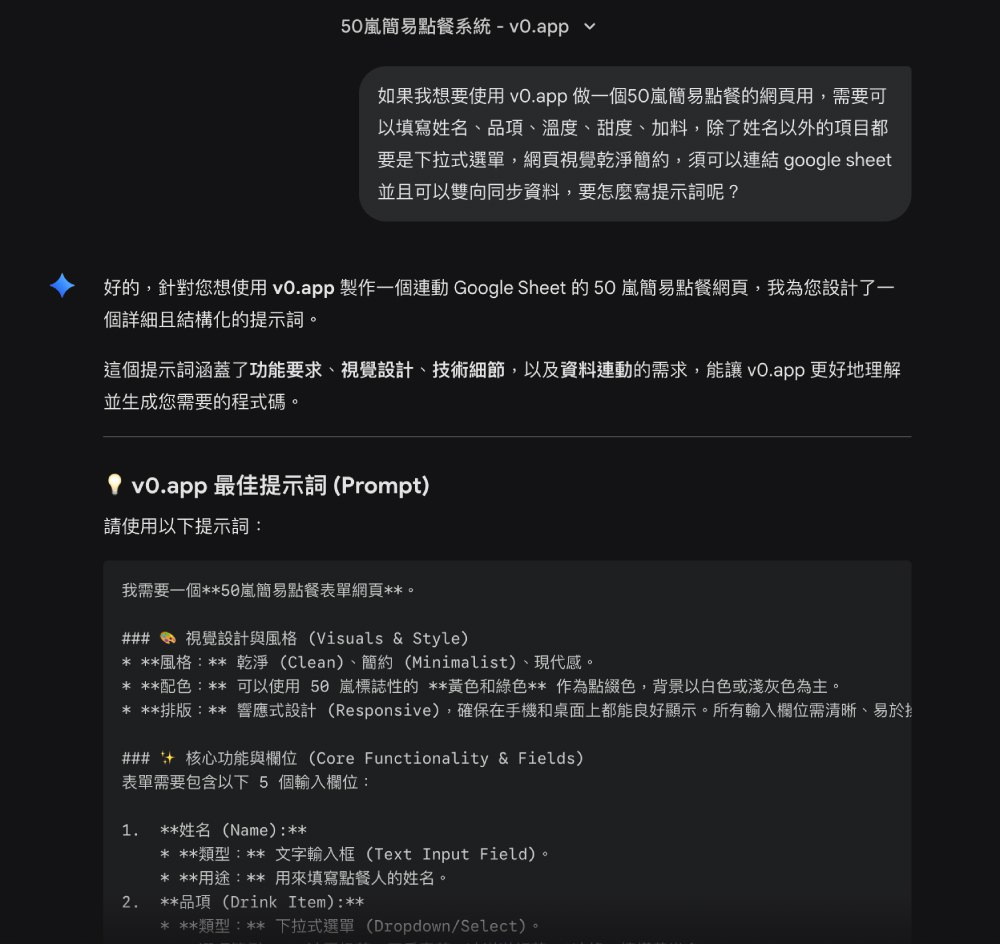
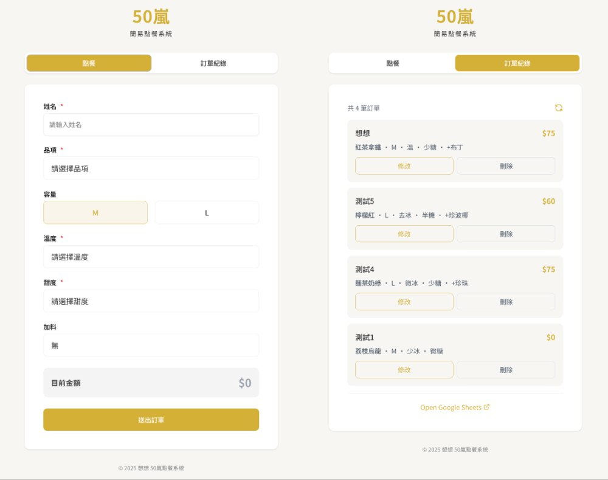

# 為了一杯 50 嵐，我竟然做了一個點餐系統

**專欄**　企業內部刊物　·　篇序 ②
**主題**　AI Coding 實作紀錄
**對應作品**　[要不要來一杯](https://muchang32.github.io/muchang-order/)（AI Lab）

> 經理在部門會議上開了個玩笑挑戰，我當天用四小時把它變成真的。

---

你有沒有因為某個誘因或小獎勵，突然覺得自己什麼技能都能立刻學會？我常常有這種情況，甚至誘因不一定很「有價值」，只是剛好戳中興趣就會爆發行動力。

這次的故事就從一杯 50 嵐開始。

## 小小玩笑，意外變挑戰

前兩週的部門會議中，同事介紹 Perplexity 的 AI 瀏覽器「Comet」。這個瀏覽器能在網站頁面內直接擷取資訊、點擊按鈕蒐集資料、把圖片文字轉成可複製內容，同事示範時剛好拿 50 嵐菜單當例子。

看到這裡，經理即興開了一個挑戰：

> 「如果有人能用 AI 瀏覽器做出 50 嵐點餐的 Google Form，資料能自動彙整到 Google Sheet，而且整個過程不能有人為操作，我就自掏腰包請大家喝 50 嵐！」

對於非常愛喝 50 嵐的我來說，這完全是天降任務。我當下眼神馬上發亮，會議結束回到座位，我立刻開始動手。

而既然都要做一個表單，那乾脆直接做成「完整點餐系統」吧！

## 找菜單，才是最難關

真正開始做才發現，最麻煩的不是做頁面，而是「取得正確的菜單」。

- 50 嵐北中南價格不同
- 同一間品牌不同分店菜單也略有差異
- 加料選項、加料價格各店也不同
- AI 直接看圖片很容易辨識錯誤

*圖 1．使用 Comet 瀏覽器辨識菜單圖片的結果*

用 Gemini 或 ChatGPT 直接生成菜單，也都不夠完整或不夠精準。

為了確保資料正確，我特別找出我們實際要訂的分店菜單，並用 Perplexity 的 AI 瀏覽器「Comet」直接在頁面操作，讓它逐一點擊、逐項確認能加什麼料、價格是否一致。

Comet 最大的好處是它的操作是可見的，你真的能看到它「操縱滑鼠」點選每個品項，最後也會把它的操作步驟記錄下來。這樣就能確定菜單內容是完整、精準的。

*圖 2．Comet 實際操作過程*

## 讓 AI 跟 AI 對話，創造高效團隊

拿到正確菜單後，後面的流程就順多了。這次使用的工具是 v0.app。

基於先前使用的經驗，不要沒有系統性地、一股腦地零散講需求，後續反而會需要大量調整，免費額度會很快用光，修改上也有一定的困難。所以我採新的策略：

1. 先用 Gemini 討論需求
2. 讓 Gemini 產生「提供給 v0 的提示詞」
3. 讓 AI 跟 AI 溝通

Gemini 生成的初稿提示詞當然不會一次就完美，需要經過多輪調整，包含 UI 需求、使用流程、輸入驗證、與 Google Sheets 的互動方式等。

*圖 3．與 Gemini 初始討論示意*

## 點餐系統完成：從零到可用，只花 2 小時

在 2 小時內就建好一個可以點餐並記錄到 Google Sheet 的簡易點餐系統，包含基本功能：抓資料 → 建置前端 → 串接試算表 → 測試資料同步。

為了讓大家可以修改或刪除訂單，又接著做「點餐紀錄」頁讓整個流程更完整。

*圖 4．點餐系統介面成品*

不愧是資服部的夥伴，測試非常嚴格！我把成品網址貼到群組後，馬上有人回報：

> 「我可以重複用同一個名字點兩次餐欸！」

於是回頭請 AI 加邏輯限制：「在輸入姓名時增加審核機制，若名字已存在資料庫，跳出彈窗引導去『修改訂單』而不是『新增訂單』。」雖然不是最嚴謹的作法，但對於解決眼前「重複點飲料」的問題，已經綽綽有餘。

完整功能調整大約又花了一些時間，**總計約 4 小時完成點餐系統。**

## 關鍵知識點：用 Google Sheet 當資料庫，為什麼需要 GAS？

在製作點餐系統過程中，這是沒有程式背景的人特別需要去理解的地方。很多人會問：「為什麼不能直接連 Google Sheet，還需要使用擴充功能 Apps Script？」

這邊補充一個技術小知識：網頁是「前台」，Google Sheet 是「後台資料庫」。兩者原本語言不通，GAS 就像是他們之間的翻譯官兼搬運工。

用日常生活的例子來說：網頁就像是招呼客人的「櫃檯」，Google Sheet 則是專門記錄大家要喝什麼的「記錄簿」。GAS 就像「店員」是他們之間的橋樑，負責把櫃檯收到的點單，翻譯好寫進記錄簿裡。

兩項會需要用到 GAS 的大原則如下：

**一、Google Sheet 的資料會「持續更新」**
- 每次載入頁面時都讀取最新資料
- 動態顯示目前點餐紀錄
- 偵測某個人是否已經點過餐

**二、需對資料做「寫入／讀取／修改／刪除」（CRUD）操作**
- 新增一筆訂單
- 修改既有訂單
- 刪除某人訂單

確保不同使用者同時操作不會覆蓋資料，這類行為必須透過 GAS 才能穩定執行。

簡單說：只要 Google Sheet 不是「靜態資料」，幾乎都會需要 GAS。而 AI coding 工具（v0、Bolt、Lovable 等）通常都能自動生成相對穩定的 GAS 程式碼，成功率也比自己寫高很多。

## 從一杯飲料開始，你也可以做出自己的工具

從會議結束，基本功能花 2 小時，後續修調總共花 4 個多小時。這是一個完全沒有資訊系統開發背景的人，在 AI 輔助下所能達到的速度。

這次的經驗讓我體會到：**技術不再是高牆，想法才是關鍵。**

你也有什麼 idea 想變成網頁或 APP 嗎？現在就開始動手做吧！

*（以上做法皆為個人實作經驗，若有更好的做法或想要討論的地方歡迎交流。）*
