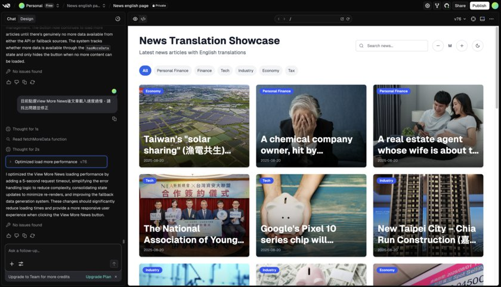
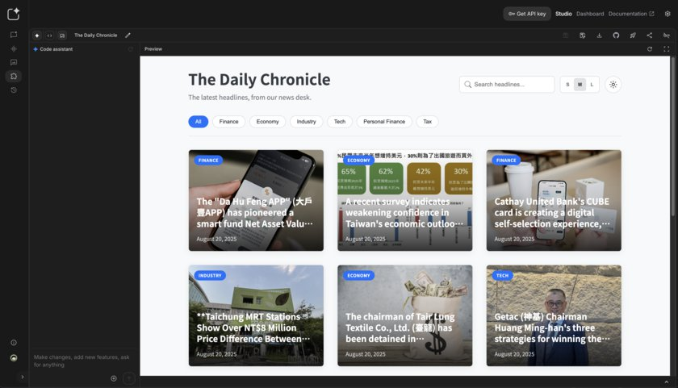
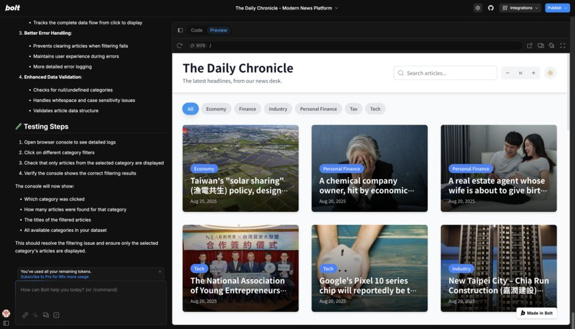
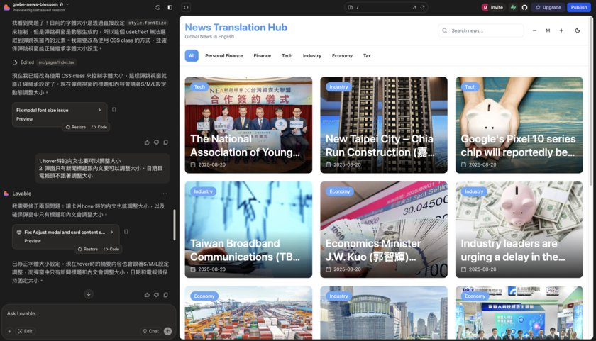

# 大 AI 時代來了：不會寫程式，也能在 5 分鐘內做出網站！

**專欄**　《聯8達》企業內部刊物　·　篇序 ③
**主題**　四款 AI 網頁生成工具實測比較

> 同一個網站用 v0、bolt.new、Google AI Studio、Lovable 各做一版，四款工具的實測比較。

---

還記得以前做一個網頁原型，要先畫設計稿、切版、寫語法、Debug…現在，AI 讓這一切變得像泡咖啡一樣簡單：幾句話、幾個提示詞，網頁就完成了。

## 我們的角色正在改變

AI 浪潮下，我們不再是埋頭苦幹的執行者，而是掌控全局的指揮官。AI 不是來搶工作，而是變成一個不會抱怨、隨時待命的超強夥伴。

有時候會抓到 AI 在偷懶？當然，它還是會偶爾亂講話、給你奇怪的結果，但隨著技術迭代，這些問題就像 90 年代的網頁跑馬燈——只是過渡時期的笑話。

## Vibe Coding：用感覺寫程式的魔法

最近爆紅的概念 **Vibe Coding** 就是「先跟著感覺做，不被細節卡住」。

對不會寫程式的人來說，就像魔法：

- 從想法到互動原型，只要 1 分鐘
- 省下大量驗證和修改時間

AI 幫你處理最麻煩的技術細節，讓你專注在「創意」本身。

## 4 款 AI 網頁生成工具實測

我用同一個網站需求，在四款工具上各做了一版，真實感受如下。

### 1. v0.dev

v0 是我最早接觸的工具。剛開始因為不熟悉操作，浪費了幾次免費額度。熟悉後發現，它的彈性很高：可以依提示詞生成互動原型、直接編輯程式碼、針對單一物件做數值調整，也能與 Github 整合，一鍵建置專案並分享給工程師，檔案協作很方便。

最近 v0 還推出 Agent 功能，理論上能更主動幫忙修改，實測起來反而比以前不穩定，經常出現「自作主張修改」或「過度修改版面」的情況，我多半需要直接指定要刪改的程式碼才比較準確。期待後續更新能改善穩定性。

### 2. Google AI Studio

速度有時讓人等到出戲，咖啡都快喝完了還沒做完，修改結果常與預期不符，甚至左側交談區顯示已修改但右側預覽區卻沒有實際同步反應，需要反覆提醒才會正確更新。

另外麻煩的點是它為了推銷自家 firebase 沒有跟 Github 整合，網站完成後要手動下載再上傳整個專案到自己的程式庫，流程相對麻煩。但因為免費且沒有修改次數的限制，最後反而變成我的保底版本——先出了 Google AI Studio 版本實作的網頁後，才開始研究其他工具。

### 3. bolt.new

bolt 功能也很齊全，一樣是用提示詞生成網頁、支援對單一物件用提示詞修改，也有提示詞最佳化，甚至有提示詞範例庫，提供常用的提示詞直接使用，也能連結 Github，自動同步更新修改。

不過後期遇到一些 bug，重複修復也無法正常顯示，加上每天有 token 上限，限制了更深入的測試。

### 4. Lovable

全球使用者最多、最熱門，速度快，設計上也有巧思。功能上也都很齊全，包括單一物件修改、提示詞最佳化、Github 連結等，修改時也會自動同步更新。雖然後期偶爾會出現修改顯示延遲，但再次執行通常能成功。在這四款中，Lovable 的穩定性表現算是相對較好的一個。

## 總結

雖然功能與介面大同小異，四款工具各有亮點：

| 工具 | 亮點 | 限制 |
|---|---|---|
| **v0.dev** | 生成速度快、操作靈活 | 新推出的 Agent 功能仍在磨合期 |
| **Google AI Studio** | 免費且不限次數 | 速度偏慢、無 Github 整合 |
| **bolt.new** | 功能全面、有提示詞範例庫 | 每日 token 上限較低 |
| **Lovable** | 整體最穩定 | 偶有修改顯示延遲 |

## AI 生成程式碼的限制

在 AI 網頁原型的時代，還沒有一款完美的工具出現，但它們已經讓「不會寫程式也能做網站」成為日常。AI 能在短短三天內產出 v0.1 甚至 v0.9，非常適合用於 PoC（概念驗證）。

只是，每次修改都有點像拆驚喜包——不知道跑出來的是驚喜還是驚嚇。**生成的程式碼結構往往像雜物間——能用但混亂。若要正式上線，仍需工程師重構，否則後續維護將成惡夢。**

總體而言，這些工具能明顯地縮短原型開發時間，但距離直接用於生產環境還有一段距離。

## 未來：AI 讓創意直達螢幕

AI 工具短期內不會取代資深設計師與工程師，但它們已經成為加速創意實現的神兵利器。

想像一下未來的場景：你一邊喝咖啡，一邊對 AI 說：「幫我做一個像 Netflix 一樣的網站，主色調改成湖水綠。」幾分鐘後，它就幫你跑起來了。

到那時，問題不再是「你會不會寫程式」，而是「你想創造什麼」。

AI 不會奪走你的飯碗，但會讓善用它的人，成為下一波浪潮的領航者。
