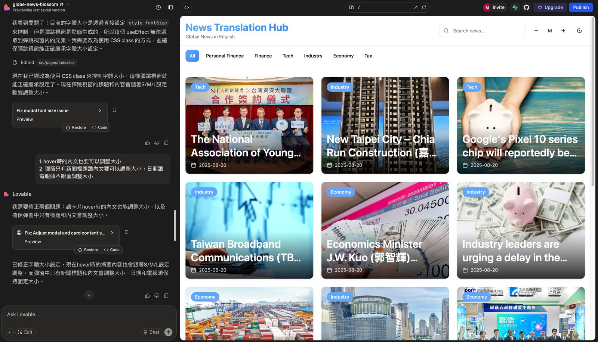

# 從原型到上線：實測 Lovable 的完整使用體驗

**專欄**　企業內部刊物　·　篇序 ④
**主題**　單一工具深入實測
**延伸閱讀**　[大 AI 時代來了：不會寫程式，也能在 5 分鐘內做出網站！](03-ai-era.md)

> 四款裡最穩的一款，從介面到實際操作流程的完整心得，含提示詞寫法。

---

上一篇整理四款 AI 網頁原型工具的實測心得，包含 v0.dev（2025/08/11 更名為 v0.app）、bolt.new、Google AI Studio 和本文的主角 Lovable。

Lovable 是個人認為目前體驗最穩定、操作最直覺的一款網頁原型工具。雖然它不是功能最花俏、最絢麗的，在實務面需要的穩定度、操作流暢性和生成結果的可控性上，表現都相當亮眼。這篇將深入分享 Lovable 從介面設計到實際操作流程的完整使用體驗。

## 為什麼選擇 Lovable？

**生成速度表現優異**
相較於其他工具動輒需要等待數分鐘的情況，Lovable 通常能在 30 秒內完成初版生成。生成速度對於需要快速迭代的工作流程來說很重要。

**修改同步穩定可靠**
實測中發現，Lovable 的即時預覽同步率、準確率相當高，修改指令下達後，預覽區域能夠準確反映變更，減少重複確認的時間成本。

**設計上會有小巧思**
在同時使用四個工具實作的時候，Lovable 在設計方面會有些小巧思。例如：自動加入毛玻璃效果、卡片陰影的層次感以及適度的圓角處理等，這些細節讓生成的網頁質感提升了一個層次。

## 介面導覽

Lovable 主要分為兩大區塊：左側是對話區，右側是即時預覽區。讓使用者可以專注在對話和結果上，不會被過多的功能選項分散注意力。

- **對話區**：整合了所有的互動功能，包括指令歷史記錄和底部的輸入框。每個修改步驟都清楚保留，方便隨時檢視調整過程。輸入框支援文字指令和圖片上傳，可以根據需求選擇最適合的溝通方式。
- **預覽區**：顯示的是完全可互動的網頁，所有功能都能實際操作測試。這種即時互動的預覽方式，能夠立刻感受到使用者的真實體驗。

## 實際操作流程分享

### 情境一：有內容想法但沒有明確畫面

當你對網站內容有大概的想法，但還沒有具體的視覺構想時，可以用比較概括、粗略的方式描述需求。可以不斷要求 AI 修改，它也能耐心回應，讓 AI 初步生成基礎版本，再從中找靈感進行調整。

**起手式：大方向描述**
> 「我想做一個產品展示頁面，主要展示我們的三項核心服務，風格要專業但不死板。」

**從生成結果找靈感**
AI 會根據描述生成一個初版，這時候不用急著評判好壞。雖然你罵 AI，它也不會有情緒，但我們要發揮人的溫度，學習看它的優點，從中找到喜歡的元素。可能是某個區塊的配色、某個元件的排列方式，或是某種視覺效果。

**基於靈感進行調整**
> 「我喜歡這個卡片的設計，但希望把三個服務改成橫向排列」
> 「這個藍色調很不錯，能不能把整個網站都統一用這個色系？」

### 情境二：腦中已有明確畫面

當你心中已經有比較清楚的設計想像時，描述得越具體，生成結果就越接近你的預期，就像一個可交代的助手一樣。

**詳細描述每個元素**
> 「我想要一個深色背景的首頁，頂部有透明導航列，中央是大標題配一張產品圖片，下方有三個功能介紹卡片，每個卡片都有圖示、標題和簡短描述。」

**運用條列式修改指令**
在修改階段，建議用條列式的方式一次給出多個調整需求，這樣比較不會遺漏，也讓 AI 能夠統一考慮所有變更：

> 請幫我調整以下幾個地方：
> 1. 主標題字體加粗，顏色改為白色
> 2. 三個卡片的間距加大一些
> 3. 每個卡片加上 hover 效果

**善用圖片參考**
如果有難以用文字描述的視覺效果，直接上傳參考圖片會更準確。Lovable 能夠理解圖片中的設計元素，並將其融入到網頁中。

### 功能新增的建議

**明確標註設計需求**
在新增功能時，除了說明功能本身，也要清楚描述該功能的視覺設計和相對位置：
> 「在右上角新增一個搜尋框，使用圓角設計，搜尋圖示放在輸入框內右側，整體風格要與現有的導航列保持一致。」

**保護既有設計**
為了避免新功能影響原有設計，可以明確指出哪些區域不要動：
> 「新增購物車功能到導航列，但請保持現有的 logo 和選單項目不變。」

## 實戰技巧分享

**善用「像 XXX 網站」的描述**
與其花時間解釋你想要的風格，直接說「做一個像 Spotify 首頁的音樂播放器」或「仿照 Airbnb 的卡片設計」會更精準。先臨摹再改進，最後創造自己的風格。

**分模組思考**
把網站想成幾個獨立的區塊：導航列、主要內容、側邊欄、頁尾等。先確保每個區塊能正常運作，再考慮整體協調性。這樣即使某個部分需要重做，也不會影響到其他區塊。

**善用「繼續前面的設計風格」**
當你對某個元素的樣式很滿意時，可以說「用同樣的設計風格做一個 XXX」。

**描述功能時加上使用情境**
與其說「加一個搜尋功能」，不如說「加一個可以搜尋產品名稱的搜尋框，放在頁面右上角，使用者可以直接輸入關鍵字找產品」。情境描述讓 AI 更容易理解你的需求。

## 對工作模式的改變

使用 Lovable 這段時間，最大的改變是思維模式的轉換。

**以前會先想「這個技術上做不做得到」，現在會先想「這個對使用者有沒有價值」。** 同時也可以讓自己思考「怎麼說出 AI 聽得懂的話」，讓 AI 工具更能忠實呈現我們腦中的想法。

當技術實現不再是瓶頸，產品思維和使用者體驗反而變成了關鍵。AI 工具讓我們有機會回到最本質的問題：我們到底想為使用者創造什麼價值？

重點不是 AI 有多聰明，而是它讓每個有想法的人，都有機會把想法變成可以看得見、摸得到的東西。這樣的改變，或許比我們想像的更深遠。
