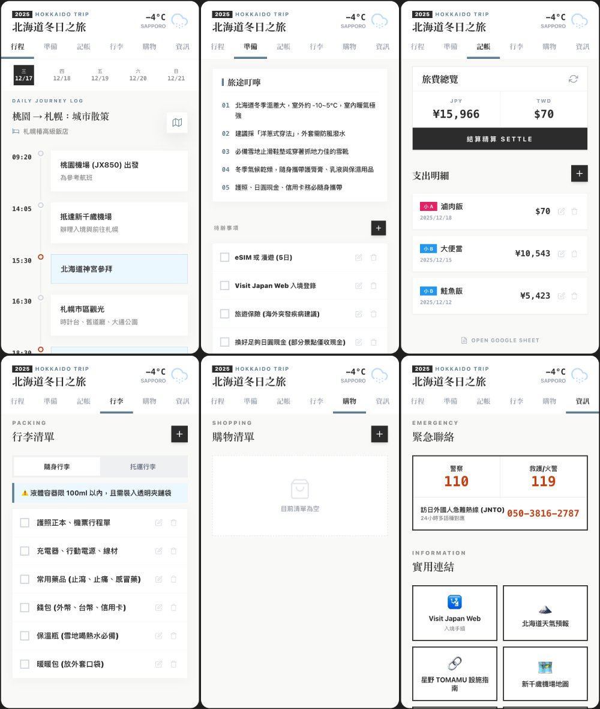

# 請你跟我這樣做！保姆級旅遊 APP 教學（附模板）

**專欄**　《聯8達》企業內部刊物　·　篇序 ⑤
**主題**　從零到可用的實作教學
**延伸閱讀**　[為了一杯 50 嵐，我竟然做了一個點餐系統](02-50lan.md)

> 有讀者說「看起來很厲害，但跟我沒關係」，所以我改從日常旅遊重寫一篇，附模板讓人直接跟著做。


---

上一篇《為了一杯 50 嵐，我竟然做了一個點餐系統》刊出後，收到不少回饋。有些人開始私下問我 AI coding 的技巧，也有人跟我說：

> 「看起來很厲害，但感覺跟我沒什麼關係，我應該也用不到吧？」

我完全能理解「寫程式」、「做系統」這幾個字，對很多人來說，是跟自己完全沒有關係的一件事，甚至覺得我工作都做得好好的，為什麼要改變我熟悉的工作模式。

為了讓大家更能體會 AI coding 與人的真實距離，我們先不談工作而從日常，以一個普通人的角度出發，看 AI coding 能幫你做什麼？

這篇，我選了很多人「應該」會有感的主題——**旅遊，一個為自己而生的旅遊 APP**。我會在文末附上 AI Studio 及 Google Sheet 模板，讓你看完馬上能試做。

## 為自己量身打造的「隨身導遊」



先簡單介紹這次的旅遊 APP。基於隱私考量，APP 中的行程內容為網路上隨機找的旅行團資料，僅作為示範使用。

打開 APP，你會看到：

- 一個清楚的大標題
- 右上角顯示旅遊地點的即時天氣
- 下方是整個 APP 的核心功能區塊

包含：**行程、準備、記帳、行李、購物、資訊**，還有一個小彩蛋等大家自己去發現。

在「行程」頁中，可以用日曆切換每天的安排，並依實際旅遊日期彈性調整。你只需要把完整行程提供給 AI Studio，它就能自動幫你：調整成正確的日期、重新整理每日行程內容、同步更新「準備事項」「旅途叮嚀」「代辦清單」，甚至依照旅遊地點與氣候調整提醒內容。

例如：如果行程中有滑雪行程，準備清單就會自動出現「手套、毛帽」；如果有迪士尼樂園，資訊頁就會幫你補上官方連結。

當然，你也可以再手動修改，讓整個 APP 變成真正只為你存在的版本。

## 痛點擊破：多人分帳不再頭痛

在所有功能裡，我特別想分享的是「記帳」。

這個記帳功能支援**多人分帳**：一筆花費可以選擇平均分攤，或自行輸入每個人的金額，並且可以做到最終結算，誰該給誰多少日幣或台幣，完全省去自己算錢的大工程。

目前示範版本以雙人為主，但如果你是多人同行，只要跟 AI 說清楚實際人數、名稱，甚至幣別需求，並且修改 Google Sheet 欄位，就能延伸使用。

## 建立 APP 的整體流程

1. **在左側對話區貼上你的完整旅遊行程**
   讓 AI Studio 先幫你生成並調整整體行程內容。
2. **微調每日行程細節**
   確認日期、地點、順序是否符合你的實際安排。
3. **檢查核心功能與清單**
   看看「準備事項、行李、代辦、資訊」是否有需要補充或刪減的地方。

確認整體結構沒問題後，再進行記帳資料串接。

## 手把手教學：三步驟完成你的記帳功能

記帳功能背後需要一個地方存資料。這次我使用的是 Google Sheet 當作資料庫。

延續上一篇提過的概念：只要涉及「寫入／讀取／修改／刪除」，就需要搭配 GAS（Google Apps Script）。

### Step 1. 準備你的資料庫（Google Sheet）

1. 開啟模板
2. 點選「檔案 → 建立副本」
3. 建立一份屬於你自己的記帳試算表
4. 內容先不要刪，當作假資料顯示用

### Step 2. 讓 AI 幫你寫程式（GAS）

建立完成後，回到 AI Studio，貼上以下這段 prompt：

```
我需要重新連結記帳的 Google Sheet。
欄位定義如下：A:日期, B:項目, C:付款人, D:台幣, E:日幣,
F:小A(台), G:小A(日), H:小B(台), I:小B(日), J:備註。
目標工作表名稱為：『示範用旅遊記帳』。
需求：資料需要可以雙向同步（APP 顯示與試算表一致）。
請提供對應的 GAS 程式碼，並告訴我是否需要重新部署？
```

### Step 3. 部署與串接

1. AI 會生成一段程式碼給你
2. 回到你的 Google Sheet，點選上方選單「擴充功能 → Apps Script」
3. 將原本的內容清空，貼上 AI 給你的程式碼
4. **關鍵動作：點擊「執行」測試**

如果下方出現紅色錯誤訊息，請直接把錯誤訊息複製貼回給 AI，跟他說：「執行時出現這段錯誤，請修正。」它會幫你改好程式碼，再把改好的程式碼覆蓋原來的，重複上述動作。

5. 確認無誤後，點擊右上角「部署 → 新增部署 → 網頁應用程式」
6. 將取得的部署網址（Web App URL）貼回給 AI Studio，請它更新連結

只要這三步完成，你的 APP 就能即時讀取並寫入那張 Google Sheet 了。

## 遇到卡關？讓 Gemini 成為你的技術顧問

在開發過程中，你可能會遇到報錯、畫面跑版，或者資料抓不到。這時候請記住一個最重要的心法：

> **不要直接在 AI Studio 裡除錯，請移駕到 Gemini 詢問。**

最安全的操作流程是：保持 AI Studio 視窗不動，另開一個 Gemini 視窗。把 Gemini 當成你的資深技術顧問，將錯誤訊息丟給它分析，等到找出原因後，請 Gemini 幫你擬定「給 AI Studio 的修正指令」，再把這段指令貼回 AI Studio，讓它自動幫你執行修改。

向 Gemini 提問時，不要只說「壞掉了」，而是盡可能告訴 AI 詳細情況、問題細節，AI 才能精準判斷，而不是通靈猜測——沒有交代清楚反而有越修越糟糕的可能。建議提供以下資訊：

- 你正在用什麼工具（例如：我正在使用 Google AI Studio 寫 GAS）
- 做的是哪一種 APP（例如：旅遊記帳 APP）
- 卡在哪個功能（例如：雙人分帳計算錯誤）
- 如果有錯誤代碼、錯誤歷程，直接貼上

有時候卡很久的問題，換一個 AI 幫你順一下邏輯，會突然迎刃而解。

---

*文末原附有 AI Studio 與 Google Sheet 模板連結，公開版本請確認模板的分享權限後再放上。*
